# distance
**Find average distance between random points in an N-dimensional cube.**

This is a fun math exercise.
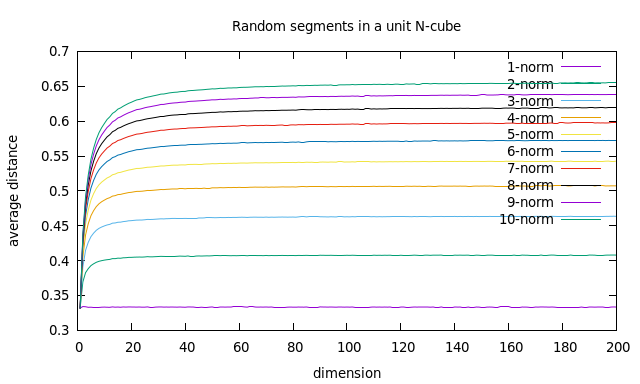

- [distance](#distance)
  * [One dimension:](#one-dimension-)
    + [Mathematically:](#mathematically-)
  * [Two Dimensions](#two-dimensions)
  * [Higher Dimensions](#higher-dimensions)
  * [Monti Carlo method](#monti-carlo-method)
- [Program](#program)
  * [Getting it](#getting-it)
  * [Simple installation](#simple-installation)
  * [Usage](#usage)
  * [Example](#example)
  * [Precision](#precision)
  * [Results](#results)
- [Plotting](#plotting)
- [Parallel processing](#parallel-processing)
- [Discussion](#discussion)
  * [Known results](#known-results)
  * [Further](#further)

## One dimension:
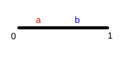

Consider a pair of point chosen randomly on a unit line segment:

* What is the average distance between them?
* Can you prove it mathematically?
* Can you test it by trying a lot of random points?

### Mathematically:
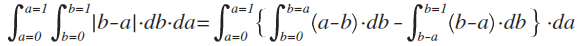 
Plug into [maxima](http://maxima.cesga.es/):
> integrate((integrate(b-a,b,a,1)+integrate(a-b,b,0,a)),a,0,1);
> 
> (%o1)	1/3

## Two Dimensions
Consider 2 random points in a unit square:

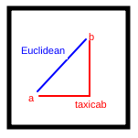

There is more than one way to measure the distance between the points:

* Taxicab or Manhattan -- distance in each dimension separately
 * Red in the diagram
 * This makes the problem separable
 * Each dimension adds 1/3 to the total average since each dimension is independent. 
* Euclidean -- the conventional distance
 * Blue in the diagram
 * The equation is non-linear:
 * 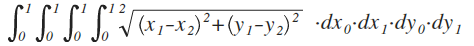
* General [Lp metric](https://en.wikipedia.org/wiki/Lp_space): 
 * 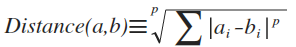 
 * Taxicab p=1
 * Euclidean p=2

 ## Higher Dimensions
 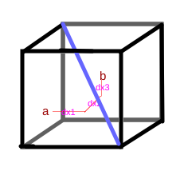

 * The program can be generalized to arbitrarily higher dimensions
 * One characteristic distance to note is the longest diagonal
  * from point (0,0,0...) to (1,1,1,...)
  * For dimension D and Lp metric p: 
  * diagonal = D^(1/p)
  * From my colleague Dr. Kendrick Shaw this is better termed the **p-norm**

  ## Monti Carlo method
  
* Rather than solving the equtions directly, simulate with random points
 * Each coordinate of each point is evenly distributed from 0.0 to 1.0
 * Distance can be measured using the applicable metric
 * The average distance can be measured

  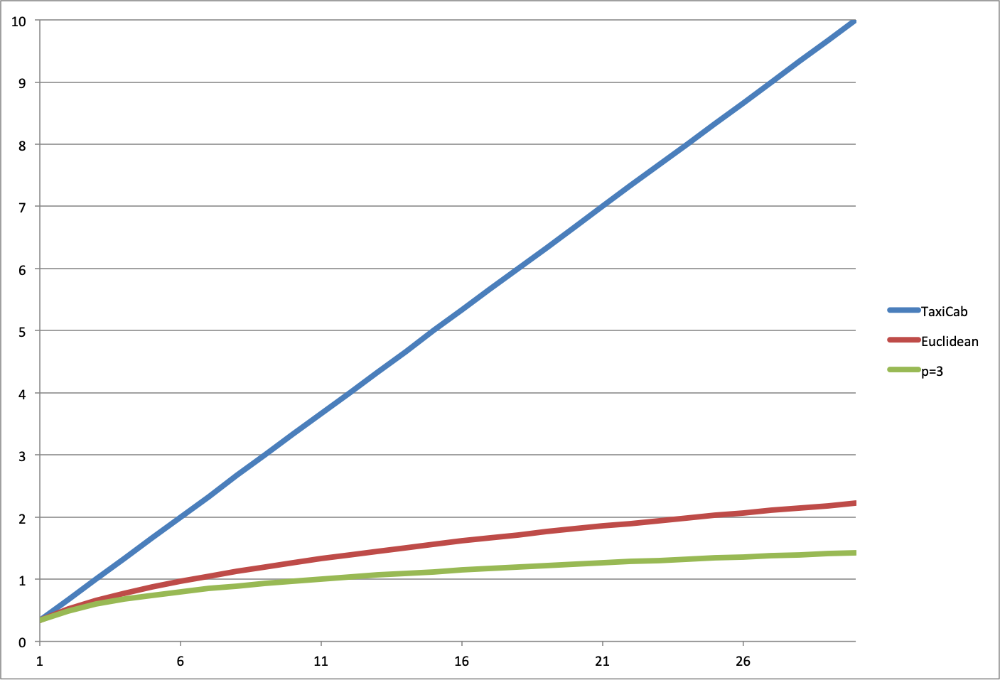
  
 * My colleague Dr. Albert Mao correctly points out that the program uses a rather poor random number generator. Much better ones aare available (or random physical phenomena can be harvested). Surprisingly, the results are still good.
  
# Program
## Getting it
[Github location](https://github.com/alfille/distance)

## Simple installation
```
# Get code
git clone http://github.com/alfille/distance

# Go to program directory
cd distance

# Compile and make executable
make
chmod +x distance

# optional to install
sudo cp distance /usr/bin/distance

# otherwise run from directory
./distance
```
The only requirements are a working C complier and git
Actually, if you download the code you only need any C compiler
`cc -o distance distance.c`

### High resolution
See below under advanced for high-resolution versions
 

## Usage
`./distance -h`

```
distance -- find the average distance between random points in
	a unit N-cube using Monti Carlo method.

By Paul H Alfille 2021 -- MIT license

Output is CSV file format to make easy manipulation.
A number of metrics are used including
	1	(Manhattan) |x1-x2| in each dimension
	2	(Euclidean) sqrt(sum((x1-x2)^2)) 
	3	[sum((x1-x2)^3)]^1/3 

Syntax:
	distance [options]
Options:
	-d 100	max dimensions
	-p 3	max power (metric)
	-r 1000000	random points each measure
	-n	normalize (to longest diagonal)
	-h	this help

```
The output is a CSV (comma-separated-values) file that can be imported into man programs (e.g. Excel)

## Example
`./distance -p 10 -r 100000 -d 200 -n > Sample.csv`

In fact that result is in the `example` directory

Result:
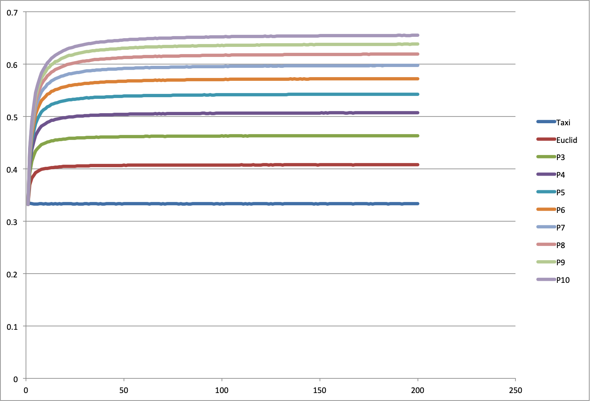

* x-axis: Dimension
* y-axis: Average segment length (normalized to longest diagonal)
 * Clearly the length is bounded by the maximum length so the average normalized value must be < 1 
* Curves: Different p-norms from p=1 to p=10

## Precision
Calculations are done in [double precision](https://en.wikipedia.org/wiki/Double-precision_floating-point_format) floating point which limits the exponent to about 10^-300. Since the calculation involves multiplying numbers from 0.0 to 1.0 by themselves, dimension = 200 is probably safe. (i.e. 0.1^200)

## Results
Note that the normalized (to the longest diagona) appears to reach an assymptotic value for each power at higher dimensions.

Lets pivot the analysis to p-norm segment limit at increasing dimension 

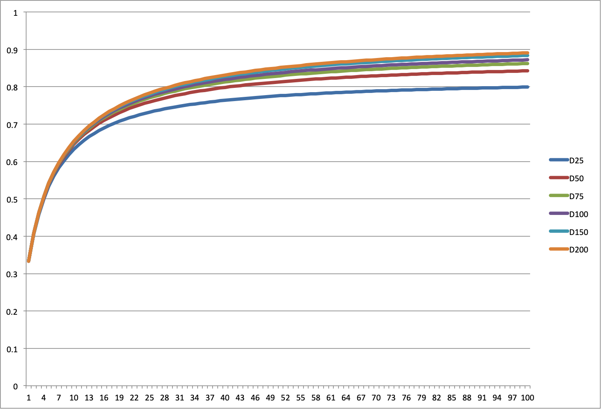

* x-axis: p-norm (p in Lp metric)
 * Note this is p-norm now, not dimension, on the x-axis
* y-axis: Average segment length (normalized to longest diagonal)
* Curves: Various dimensions (25,50,75,100,150,200) -- so incresing dimension suggesting a limitting case
* Since Linf devolves to the Max metric, it makes sense that values approach 1.0 ( i.e. the max value of an infinite number of random values in [0,1] -> 1 )

# Plotting
Although the examples here are done with Excel, there is a script based on the ubiquitous [gnuplot](http://www.gnuplot.info/)

* either pipe data directly `./distance -r10000 -n| ./plot.sh`
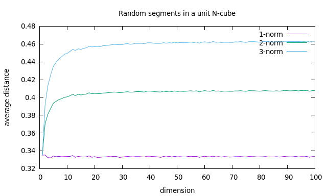
or use the filename as an argument `./plot.sh example/sample.csv`


# Parallel processing
There is an [impressive rework](https://github.com/kms15/cubedistance) of this project by Dr. Kendrick Shaw using TensorFlow on GPUs with 400-fold speedup!

# Higher resolution
### distance 
 * The standard `distance` program suffers from:
 * Poor random number algorhythm (C library `rand()` )
 * double precision limitations 53-bit mantissa, exponent 10^-308
 * stack allocation of large arrays
 * Specifically the concern about precision is that at high power dx^p could pinned at zero (0<dx<1)
 * The segment length (dx) is weighted to shorter lengths (see [bin.py](example/bin.py)) 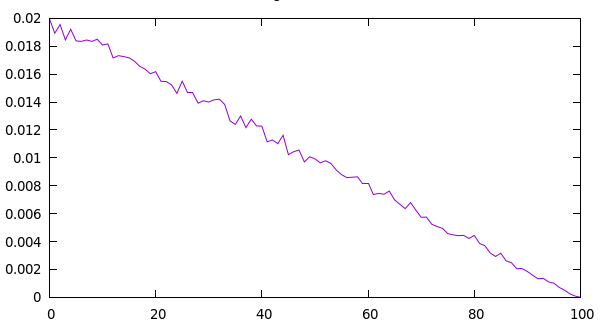 
 * so 2% of samples will be <.01 -- underflow at p=150 causing a systematic underestimation

###  distance_hr
 * `distance_hr` uses high resolution floating point variables
 * C libraries [GMP](https://gmplib.org/) and [MPFR](https://www.mpfr.org/)  
 * Load development version e.g. `sudo apt install libgmp-dev` and `sudo apt install mpfr-dev`
 * Uses [Mersenne twister](https://en.wikipedia.org/wiki/Mersenne_Twister) for random generation
 * build the program with `make distance_hr` (or `make all`) then `chmod +x distance_hr`
 * options are the same as for `distance`
 * by default, results are 32 digits long

###  distance_x
* `distance_x` improves on distance by addressing underflow and random number algorhythm
* Standard C library only is needed
* A modified version of the [Mersenne Twister](http://www.math.sci.hiroshima-u.ac.jp/m-mat/MT/VERSIONS/C-LANG/mt19937-64.c) is used.
 * uses time() for a seed
 * removes non-relevant routines
* Floating point math is performed on the mantissa and exponent separately using ldexp and frexp avoiding underflow
* build the program with `make distance_x` (or `make all`) then `chmod +x distance_x`
* options are the same as for `distance`

# Discussion

## Known results
Dr. Albert Mao found [known results](https://mathworld.wolfram.com/HypercubeLinePicking.html) for the 2-norm with low dimension and bounds for arbitrary dimension. 
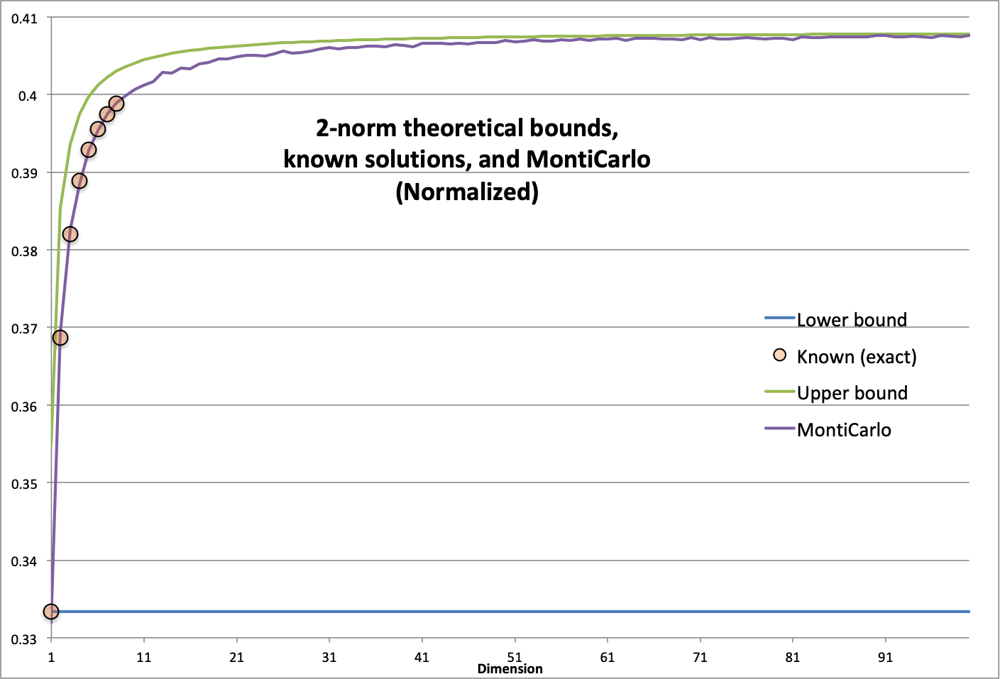

Here the results have been normalized to sqrt(dimension). Interestly, MontiCarlo simulation gives a much better estimate. The [spreadsheet](example/Known.xlsx) that generated this result is in the example directory.

## Further

If you have references to a better mathematical treatment, please include in the github comments, or to me directly at [paul.alfille@gmail.com](mailto:paul.alfille@gmail.com)


